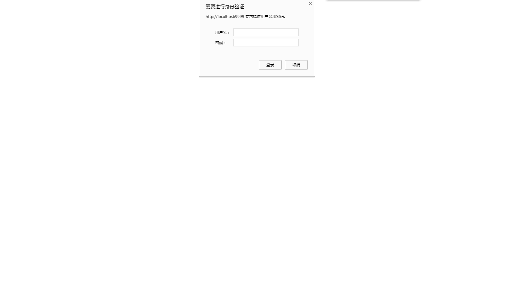
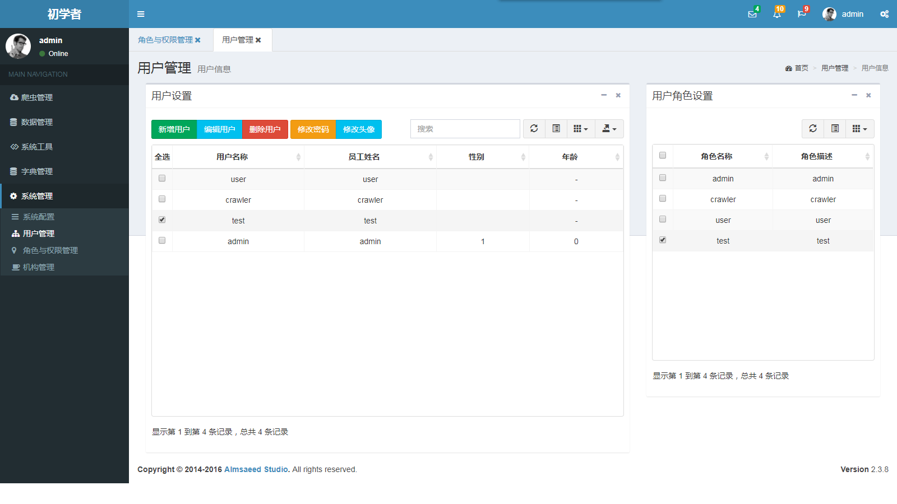
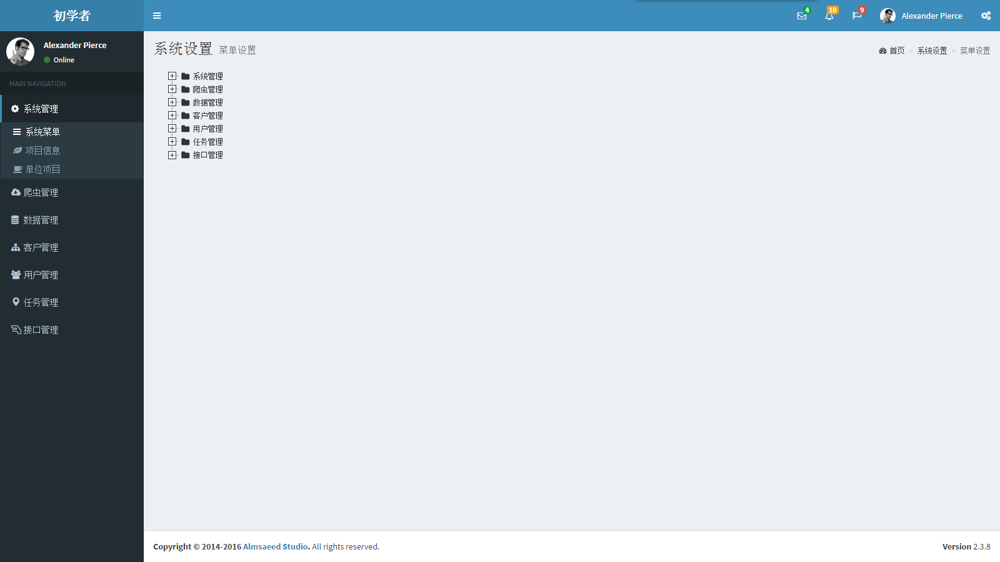
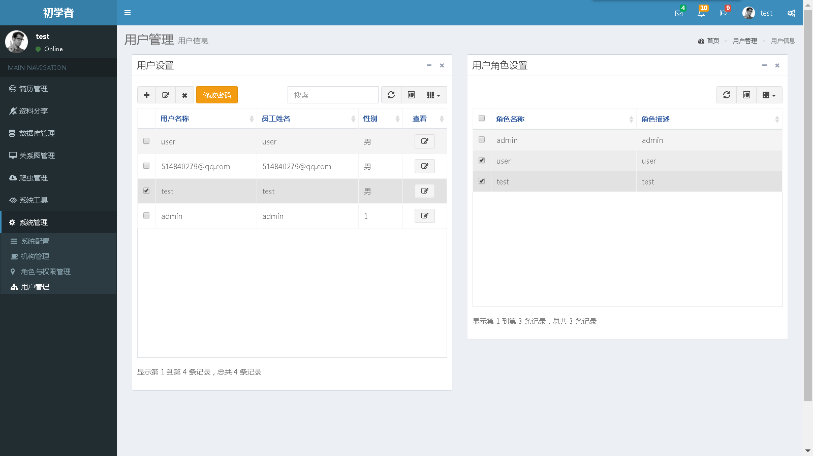
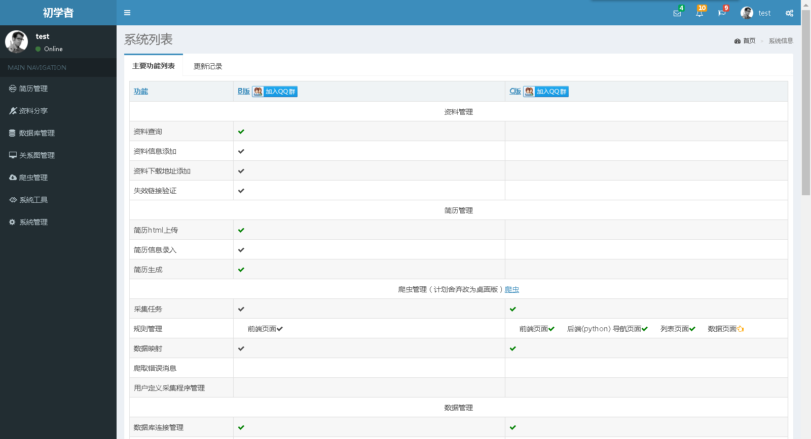
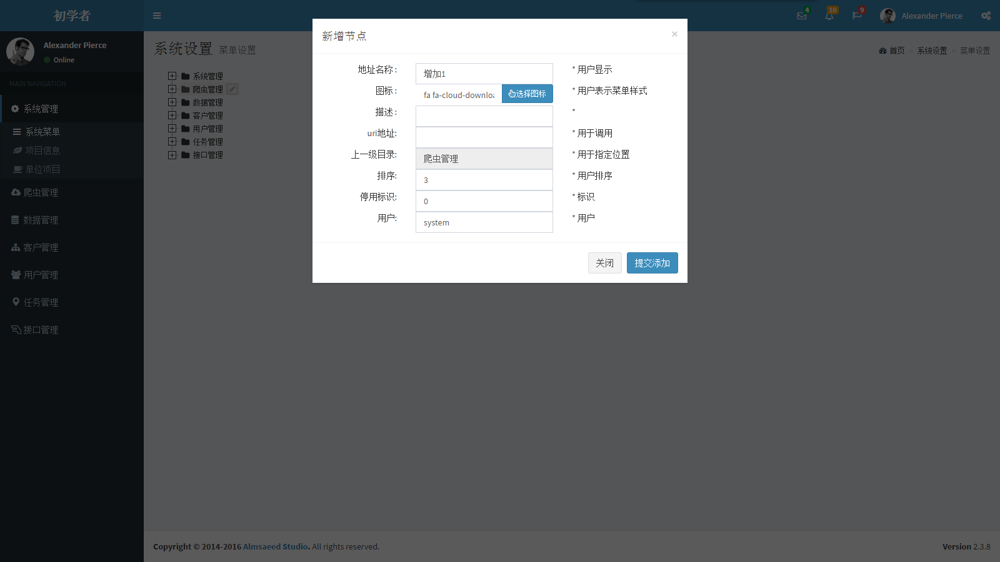

# danyuan-application

##系统采用技术或开源框架：

1. 前端框架：adminLTE
2. 前端技术：bootstrap,bootstrap-table,js,juqery,ajax,ztree,
3. 后端技术：spring-boot,security
4. 数据库: mysql
5. 其他工具：maven,

##项目启动配置:

1. 系统安装jdk1.8，mysql5.7，maven3.3
2. 新建数据库:application
3. 导入数据库脚本 sql/_mysql_menu_data.sql
4. 修改项目配置：src/main/resources/application.properties
	1. 修改数据库链接地址数据库用户名密码 
	2. 修改 server.port=9999 # 项目端口号
	3. 修改security.user.name=admin # 项目验证登录用户	       security.user.password=admin # 项目验证登录密码
5. 执行mvn clean
6. 执行mvn install
7. 执行mvn spring-boot:run(java -jar target/danyuan.jar)
8. 访问http://localhost:9999 # 端口号
9. 输入用户名、密码 admin/admin

##演示地址
http://www.danyuan.wang/#
账号密码：admin/admin

QQ群：314023211

##效果

